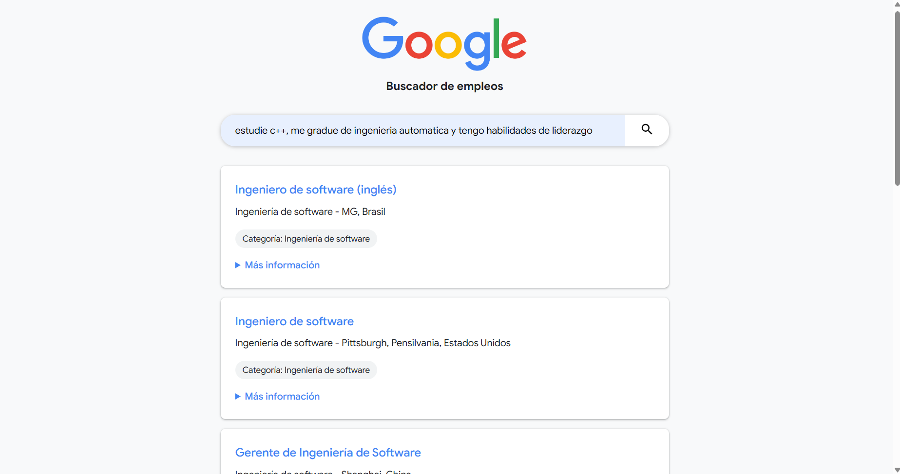

# Buscador de Empleos de Google

Este proyecto es una aplicación web que permite a los usuarios buscar ofertas de trabajo de Google utilizando consultas en lenguaje natural. Utiliza Flask para el backend, MongoDB para el almacenamiento de datos y MistralAI para el procesamiento del lenguaje natural y la generación de embeddings.

## Configuración

1. Clona el repositorio
2. Instala las dependencias requeridas: pip install -r requirements.txt

## Dependencias

- Flask: Framework web
- PyMongo: Driver de MongoDB para Python
- MistralAI: Procesamiento de lenguaje natural
- python-dotenv: Gestión de variables de entorno
- requests: Biblioteca HTTP para Python

Dependencias de desarrollo:
- autopep8: Formateador de código

## Ejecución de la Aplicación

Para ejecutar la aplicación, ejecuta: main.py
La aplicación se iniciará en el puerto 80 por defecto, o en el puerto especificado por la variable de entorno PORT.

## Cómo Funciona

1. El frontend envía una consulta de búsqueda al endpoint `/search`.
2. El backend utiliza MistralAI para generar embeddings para la consulta de búsqueda.
3. Estos embeddings se utilizan para realizar una búsqueda vectorial en MongoDB.
4. Las ofertas de trabajo más relevantes se devuelven al frontend y se muestran al usuario.

## Endpoints de la API

- GET `/`: Sirve la página HTML principal
- POST `/search`: Acepta una carga útil JSON con un campo `query` y devuelve las ofertas de trabajo relevantes

## Frontend

El frontend es una página HTML simple con CSS y JavaScript. Proporciona un campo de búsqueda y muestra los resultados en formato de lista.

### Interfaz de usuario

Así es como se ve la interfaz de usuario del buscador de empleos:

La interfaz incluye:
- Un logo de Google en la parte superior
- Un campo de búsqueda donde los usuarios pueden introducir sus consultas
- Una lista de resultados que muestra las ofertas de trabajo relevantes
- Cada resultado incluye el título del trabajo, la categoría, la ubicación y detalles adicionales que se pueden expandir

## Base de Datos

El proyecto utiliza MongoDB para almacenar las ofertas de trabajo. Cada oferta incluye:

- Título
- Categoría
- Ubicación
- Responsabilidades
- Calificaciones Mínimas
- Calificaciones Preferidas
